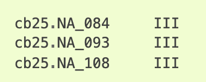

**DATA submission strategy for projects part of the CBP**

Deposition of the sequencing and assembly data is necessary for all
genomes that are part of the CBP. They can both be submitted to the
European Nucleotide Archive (ENA) or to the National Center for
Biotechnology Information (NCBI), but we recommend the ENA. In this
document, we will describe the submission process and the structure that
the projects should have.

---

**Table of Contents**

1. [ TAXID Registration. ](#taxid)
2. [ TOLID Registration. ](#tolid)
3. [ Sample Registration. ](#sample)
4. [ Project structure. ](#project)
5. [ Transferring the reads. ](#reads)
6. [ Metadata submission. ](#metadata)
7. [ Assembly Submission. ](#assembly)
8. [ Notify CBP ](#link)
9. [ GoaT Report. ](#goat)
10. [ Data Portal. ](#portal)


---


<a name="taxid"></a>
## Register a new TaxID

If the species does not have a taxonomic identifier, you must follow the instructions 
in this [link](https://ena-docs.readthedocs.io/en/latest/faq/taxonomy_requests.html) 
before you can proceed with the next steps.


<a name="tolid"></a>
## Registration of a specimen TOLID:

A TOLID ([https://id.tol.sanger.ac.uk/](https://id.tol.sanger.ac.uk/.))
is a unique identifier for an individual of a species sampled for genome
assembly. It is made by a TOLID prefix and a number to indicate the
individual that was sampled. The number is assigned in order of request
and does not represent any ranking. The prefix is made of:

-   a lower-case letter for the high-level taxonomic rank and a
    lower-case letter for the clade. Only one letter is used for
    vertebrates (VGP legacy).

-   one upper, two lower case letters for genus.

-   one upper, three lower case letters for species (one upper, two
    lower case for vertebrates, VGP legacy)

e.g. aRanTem1 for the first sampled individual of Rana temporaria,
xgPerPere3 for the third sampled individual of Peregriana peregra

For naming genome assemblies of samples, we recommend to use the full
ToLID and add .\<version\> Examples:

-   fCotGob3.1 (first assembly version of the 3rd individual of
    Cottoperca gobio)

-   fAstCal1.2 (second assembly version of the first individual of
    Astatotilapia calliptera)

A TOLID for the individual used for genome assembly should be registered
by the person responsible for the sample in the first place. To read more about TOLIDs
and register yours, go to the following link:
<https://id.tol.sanger.ac.uk/.>


<a name="sample"></a>
## Register the sample

Generate an ERGA/CBP Manifest via the CBP (link to be updated soon).
Emelio to provide details and instructions on how to do so. I believe we
are using the Tree of Life Checklist (ERC000053) from those listed here:
https://www.ebi.ac.uk/ena/browser/checklists. The portal will generate a
spreadsheet. This should be submit via COPO. We are still negotiating
with Rob Davey how to approve users for the CBP and who will approve the
submissions (currently a small group from ERGA direction is in charge).


<a name="project"></a>
## Project structure

We will adopt the project structure followed by the DToL. For this
purpose, separate projects for the different types of data should be
registered:

1.  Data project with all the genomic and transcriptomic data produced.

2.  Analysis project with the genome assembly.

3.  Analysis project with the alternate genome assembly (optional).

4.  Species overview umbrella project with the data and analysis
    projects as children.

The projects can be registered either to the ENA or the NCBI, 
but here we provide scripts that will automatically generate the files needed to register the studies in the ENA.
Please note that the CNAG can broker all CBP
submissions but, if desired, data submission can also be done by the
team responsible for the species. However, command line experience is
recommended, given that some of the steps can only be done
programmatically.

In order to be able to submit your own data, please make sure that you have the credentials of your ENA account or create one if you do not have one (<https://www.ebi.ac.uk/ena/submit/webin/accountInfo>). 

<a name="reads"></a>
##  Transferring the reads

Below we provide instructions on how to submit all the metadata related to the project, but in order for the submission to work, you first need to upload data files into your private Webin file upload area at EMBL-EBI. Please check instructions on how to transfer the files at: <https://ena-docs.readthedocs.io/en/latest/submit/fileprep/upload.html>. 

Our recommended way of doing this is by using the Aspera ascp command line program (<https://ena-docs.readthedocs.io/en/latest/submit/fileprep/upload.html#using-aspera-ascp-command-line-program>)

<a name="metadata"></a>
##  Metadata submission

Python scripts to generate the xml files that are required to register the projects and reads of a species in the ENA have been developed and can be downloaded from (<https://github.com/ERGA-consortium/ERGA-submission/tree/main/get_submission_xmls>). In order to run them you need to have python3 with the JINJA2 module installed in your system. 

The **get_ENA_xml_files.py** script can produce the xml files that are required to register the projects and reads (experiments and/or runs) in the ENA. If you specify the option (**--project CBP**), the generated xml files will follow the metadata requirements for the CBP. To provide the information you must give a tabular file with the **-f** option. Please check the examples directory to see which fields this file should contain. 

A run example would be: 
 ``` ~/ERGA-submission/get_submission_xmls/get_ENA_xml_files.py -f runs.ilCoeGlyc.txt -p CBP -o ilCoeGlyc_cbp ```

This command would produce the folowing files: 

- ilCoeGlyc_cbp.study.xml
- ilCoeGlyc_cbp.exp.xml
- ilCoeGlyc_cbp.runs.xml

To submit these files to the ENA, you can execute the following curl command:

``` curl -u Webin-XXXX:password -F "SUBMISSION=@submission.xml" -F "PROJECT=@ilCoeGlyc_pilot_cbp.study.xml" -F "EXPERIMENT=@ilCoeGlyc_pilot.exp.xml" -F "RUN=@ilCoeGlyc_pilot.runs.xml" "https://www.ebi.ac.uk/ena/submit/drop-box/submit/" ```

Also note that you can try submitting to the development server first, to check that everything is okay before moving on with the submission. To submit to the development server, just replace the url in the previous command with: "https://wwwdev.ebi.ac.uk/ena/submit/drop-box/submit/". More details on how to submit xml files programmatically can be found at: <https://ena-docs.readthedocs.io/en/latest/submit/reads/programmatic.html>. 

The submission.xml should look like this:

````
<SUBMISSION>
    <ACTIONS>
        <ACTION>
            <ADD/>
        </ACTION>
        <ACTION>
            <RELEASE/>
        </ACTION>
    </ACTIONS>
</SUBMISSION>
````

<u>**Species umbrella project registration**</u>

The **get_umbrella_xml_ENA.py** script can produce the xml file required to register the umbrella project of your species. If you specify the option (**--project CBP**), the generated xml file will follow the metadata requirements for the CBP. You need to specify the taxonomic description of your species and the accesion ids of the projects that were created in the previous step. 

A run example would be: 
 ```~/ERGA-submission/get_submission_xmls/get_umbrella_xml_ENA.py -s "Coenonympha glycerion" -t ilCoeGlyc1 -n "Lleonada de muntanya, chestnut heath butterfly"  -p CBP -a PRJEB71110 PRJEB71111 -x 242261 ```

This command will produce the umbrella.xml file that you can then submit like the other xml files: 

``` curl -u Webin-XXXX:password -F "SUBMISSION=@submission.xml" -F "PROJECT=@umbrella.xml" "https://www.ebi.ac.uk/ena/submit/drop-box/submit/" ```

<a name="assembly"></a>
##  Assembly submission

After completing the steps described above, a genome assembly can
be submitted. This submission will refer to a project (the project for
the assembly that we registered before), a sample, and one or more runs.
The genome assembly can be submitted to the ENA annotated or
unannotated. Detailed instructions on how to perform this step can be
found at:
<https://ena-docs.readthedocs.io/en/latest/submit/assembly.html>. To
simplify the submission process, we have included here some the
recommendations.

Before submitting your assembly, consider the highest level of assembly
which has been obtained. ENA recognizes three assembly levels. An
assembly may contain a mixture of the three sequence types:

-   **Contig:** the highest level of assembly is contigs.

-   **Scaffold:** the highest level of assembly consists of gapped
    contigs (scaffolds).

-   **Chromosome:** the highest level of assembly includes assembled
    chromosomes.

The aim of the CBP is to obtain chromosome level assemblies, but in some
cases this may not be possible. Also note that lower-level assemblies
(eg. contigs or scaffolds) can be updated to chromosome-level after
submission. The term “chromosome” in this context will include both the
nuclear and organellar chromosomes as part of the same submission.

The following instructions show how to submit a genome assembly in
chromosome-level, but with the ENA guide and this example, you should be
able to submit other level assemblies as well.

Before assembly submission some files need to be prepared. First of all,
a **manifest file** that will define the essential metadata shall be
submitted with the following structure:

-   Field name (first column): case insensitive field name

-   Field value (second column): field value

The following metadata fields are supported in the manifest file for
genome context:

-   STUDY: Study accession - mandatory

-   SAMPLE: Sample accession - mandatory

-   ASSEMBLYNAME: Unique assembly name, user-provided - mandatory

-   ASSEMBLY_TYPE: ‘clone or isolate’ - mandatory

-   COVERAGE: The estimated depth of sequencing coverage - mandatory

-   PROGRAM: The assembly program - mandatory

-   PLATFORM: The sequencing platform, or comma-separated list of
    > platforms - mandatory

-   MINGAPLENGTH: Minimum length of consecutive Ns to be considered a
    > gap - optional

-   MOLECULETYPE: ‘genomic DNA’, ‘genomic RNA’ or ‘viral cRNA’
    > - optional

-   DESCRIPTION: Free text description of the genome assembly - optional

-   RUN_REF: Comma separated list of run accession(s) – optional

Various file name fields are supported in the manifest file. Note that
all of these are optional, though of course at least one must be
provided, and some may only be relevant in the presence of other file
types. The available fields are as follow:

-   FASTA: sequences in fasta format

-   FLATFILE: sequences in [EMBL-Bank flat file
    > format](https://ena-docs.readthedocs.io/en/latest/submit/fileprep/flat-file-example.html)

-   AGP: sequences in [AGP
    > format](https://www.ncbi.nlm.nih.gov/assembly/agp/AGP_Specification/)

-   CHROMOSOME_LIST: list of chromosomes

-   UNLOCALISED_LIST: list of unlocalised sequences

In the following page
(<https://ena-docs.readthedocs.io/en/latest/submit/assembly/genome.html>)
you will find instructions on how to prepare each of the files. As a
general idea, keep in mind that you need to provide the assembly either
as a **FASTA** or a **FLATFILE**. In case you do not want to submit the
annotation, you should just give a FASTA file with all the sequences in
your assembly. However, if you want to provide the annotation, an EMBL
file should be produced and submitted with the FLATFILE option. This
embl file needs to follow the ENA format recommendations
(<https://ena-docs.readthedocs.io/en/latest/submit/fileprep/assembly.html#flat-file>).

The <u>CHROMOSOME_LIST</u> file must be provided when the submission
contains assembled chromosomes. The file is a tab separated text file
(USASCII7) up to four columns.

-   **OBJECT_NAME (first column):** The unique sequence name, matching
    with the sequence name in your FASTA file (‘\>’ line) or EMBL flat
    file (‘AC \* ‘ line).

-   **CHROMOSOME_NAME (second column):** The chromosome name. The value
    will appear as the /chromosome, /plasmid or /segment qualifier in
    the EMBL-Bank flat files. There are some restrictions on the values
    that this field should contain, check the ENA link pasted before for
    details. We recommend this to be a **number**, if the chromosome
    number is known. In case the mitochondrial genome is submitted, its
    value can be “**MIT**”.

-   **CHROMOSOME_TYPE (third column):** Allowed values:

    -   chromosome

    -   plasmid

    -   linkage_group

    -   monopartite

    -   segmented

    -   multipartite

-   **CHROMOSOME_LOCATION (optional fourth column):** By default,
    eukaryotic chromosomes will be assumed to reside in the nucleus and
    prokaryotic chromosomes and plasmids in the cytoplasm. Check the
    possible values in the ENA page.

The <u>UNLOCALISED LIST</u> file should be provided when the submission
contains chromosomes with unlocalised sequences. Unlocalised sequences
are contigs or scaffolds that are associated with a specific chromosome
but for which order and orientation is unknown. An example unlocalised
list file:



The unlocalised list file is a tab separated text file (USASCII7)
containing the following columns:

-   **OBJECT_NAME (first column):** the unique sequence name matching a
    FASTA header or flatfile AC \* line

-   **CHROMOSOME_NAME (second column):** the unique chromosome name
    associated with this sequence. This must match with a
    CHROMOSOME_NAME in the chromosome list file.

The <u>AGP</u> file might be used to describe the assembly of scaffolds
from contigs or of chromosomes from scaffolds.

Once all the files needed for assembly submission are ready, they need
to be validated, uploaded and submitted using the [Webin command line
submission
interface](https://ena-docs.readthedocs.io/en/latest/submit/general-guide/webin-cli.html) (Webin-CLI).
Please refer to the [Webin command line submission
interface](https://ena-docs.readthedocs.io/en/latest/submit/general-guide/webin-cli.html) documentation
for full information about the submission process.

<a name="link"></a>
## Notify CBP 

Once your submission is complete, you should notify it to the CBP by filling in the following form: <https://forms.gle/Ltg6PDS6xwKNec2f6>. This will allow us to review the quality of the assembly and add your project as a child to the CBP umbrella. 

<a name="goat"></a>
##  GoaT Report

[GoaT](https://goat.genomehubs.org/) is the official sequencing status tracker of the Earth Biogenome Project.
From the CBP we generate a [report](https://docs.google.com/document/d/1v07sLdzDiWF5Pge4hYUd67wQ-dXTWK7EMRTp0i0vlD8/edit#heading=h.r98o47b47e3u) that updates GoaT, thus the EBP, with our sequencing progresses.
The report is generated from the [portal](https://dades.biogenoma.cat/status) and <a href="mailto:emilio.righi@crg.eu">Emilio Righi</a> is in charge of it.

**It is very important to send an email to him to update the sequencing status of the species when:**

- the sequencing data of the species are not yet submitted to INSDC or are submitted but with an embargo (they are not public yet)
- a paper related to the sequenced species is published
- the sequencing status of the species is updated, for instance the DNA has been sequenced etc.

The portal will retrieve all the data published to INSDC under the CBP umbrella, this means that it is not necessary to update Emilio if the data are already public, the process is automatized!

For more info about the sequencing status take a look at this [document](https://docs.google.com/document/d/1v07sLdzDiWF5Pge4hYUd67wQ-dXTWK7EMRTp0i0vlD8/edit#heading=h.r98o47b47e3u)


<a name="portal"></a>
##  Data Portal

The [data portal](https://dades.biogenoma.cat/) collates the INSDC metadata with other metadata defined within the CBP, such as photos, vernacular names, custom metadata, publications and genome annotations.

- If you have any image of the collected species that you want to put in the data portal. First publish this image into Zenodo, Wikimedia or any other public images database, then provide the link to <a href="mailto:emilio.righi@crg.eu">Emilio Righi</a>
- Any other relevant information of the collected species can also be provided, catalan name, etc (Note that this are the species metadata and not the sample metadata)
- The portal has also a genome browser where the genome annotation of the sequences species can be visualized, but it is first necessary to publish the genome assembly, chromosome level, to INSDC. If this is your case you can provide <a href="mailto:emilio.righi@crg.eu">Emilio Righi</a> with genome annotation files in the following formats: the gzipped gff (gff.gz) and the tabindexed gzipped gff (gff.gz.tbi)
