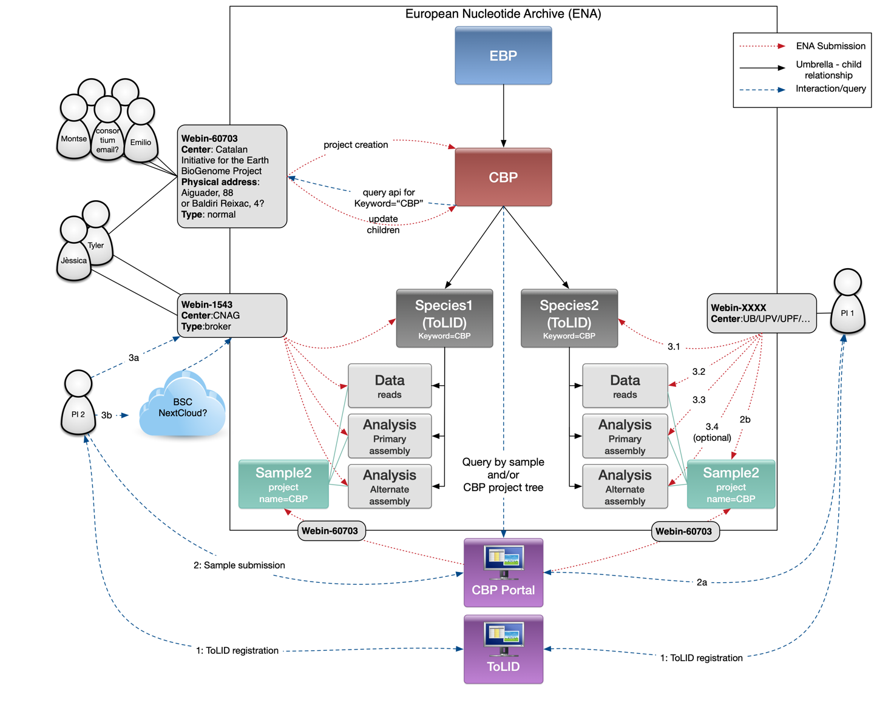

# Data Submission Workflow for the CBP

The deposition of sequencing reads and genome assemblies is mandatory for all genomes generated as part of the CBP. Both data types may be submitted to either the European Nucleotide Archive (ENA) or the National Center for Biotechnology Information (NCBI); however, submission to ENA is strongly recommended.

This document outlines the submission process and describes the recommended project structure.

Principal investigators responsible for CBP-funded projects are expected to submit raw sequencing data promptly following sequencing. Genome assemblies should be submitted within a maximum timeframe of one year after data generation.

**Table of Contents**

1. [ Sample Registration. ](#sample)
2. [ Raw Reads submission. ](#reads)
3. [ Assembly Submission. ](#assembly)
4. [ GoaT Report. ](#goat)
5. [ Data Portal. ](#portal)

---

## 1 Sample Registration

### 1.1 Registering a New TaxID

If the species does not yet have a taxonomic identifier (TaxID), you must follow the instructions in [this link](https://ena-docs.readthedocs.io/en/latest/faq/taxonomy_requests.html) before proceeding with subsequent steps.

### 1.2 Obtaining a TOLID

A TOLID is a unique identifier assigned to an individual specimen sampled for genome assembly. It consists of a species-specific prefix followed by a numerical identifier indicating the sampled individual. The numerical component is assigned sequentially upon request and does not imply ranking or priority.

For genome assembly naming, we recommend using the full TOLID followed by a version suffix in the format `.v<version>`. Examples include:

- `fCotGob3.1` (first assembly version of the 3rd individual of *Cottoperca gobio*)
- `fAstCal1.2` (second assembly version of the first individual of *Astatotilapia calliptera*)

TOLIDs for all individuals planned for sequencing should be registered in advance by the person responsible for the sample. Additional information and registration can be found at: [TOLID Registration](https://id.tol.sanger.ac.uk/).

### 1.3 Registering Samples via the CBP Portal

All samples must have an assigned BioSample accession number prior to sequencing. Sample registration can be completed through the CBP Data Portal in accordance with the provided [guidelines](https://www.biogenoma.cat/wp-content/uploads/2025/06/Guia_Portal_CBP_ENG.pdf).

## 2 Raw Reads submission

Please note that CNAG can act as a broker for all CBP data submissions. Alternatively, submission may be carried out directly by the research team responsible for the species. However, prior experience with command-line environments is strongly recommended, as certain steps in the submission process can only be performed programmatically.

To submit data independently, you must have valid credentials for an ENA Webin account. If you do not already have an account, you should create one at the following link: [ENA Webin Account](https://www.ebi.ac.uk/ena/submit/webin/accountInfo).

### 2.1 ENA Submission Scripts

Some scripts to assist in data submission have been provided. Please read the accompanying [instructions](https://github.com/cnag-aat/ERGA-submission/tree/main/get_submission_xmls#readme) to learn how to use them. Remember to provide the option `-p CBP` to create the projects with the CBP-specific template.

### 2.2 Create a Species Umbrella BioProject

An umbrella BioProject must be registered for each species assembled by the CBP. This umbrella BioProject will serve as the parent project for all data and assembly BioProjects associated with that species and will be a direct child of the CBP BioProject ([PRJEB49670](https://www.ebi.ac.uk/ena/browser/view/PRJEB49670)). For reference, please consult [PRJEB56817](https://www.ebi.ac.uk/ena/browser/view/PRJEB56817) as an example of an umbrella BioProject. You can use [this script](https://github.com/cnag-aat/ERGA-submission/blob/main/get_submission_xmls/get_umbrella_xml_ENA.py) to obtain an XML file that can be submitted to the ENA in order to create the umbrella project. Once you obtain the accession number, please report it via [this form](https://forms.gle/Ltg6PDS6xwKNec2f6) so we can add your project under the CBP.

### 2.3 Create a Read Data BioProject

A dedicated Read Data BioProject must be created to host all raw sequencing reads and associated sequencing metadata. This BioProject should be registered as a child of the species umbrella BioProject established in Section 2.2. For reference, please consult [PRJEB56813](https://www.ebi.ac.uk/ena/browser/view/PRJEB56813) as an example.

### 2.4 Transfer the Reads

Now that we have created the BioProjects, we need to populate them with the data of our species. The first step is to collect all the reads and transfer them into your private Webin file upload area at EMBL-EBI. Please check this [link](https://ena-docs.readthedocs.io/en/latest/submit/fileprep/upload.html) for instructions on how to transfer the files. We recommend performing the data transfer via the [Aspera `ascp`](https://ena-docs.readthedocs.io/en/latest/submit/fileprep/upload.html#using-aspera-ascp-command-line-program) command-line program.

### 2.5 Submit Experiments and Runs

Now we can submit all the metadata related to the reads and experiments and finalize the data submission. You can perform this step directly from the ENA Webin website or programmatically with XML files. To aid in the programmatic submission, we provide a series of Bash and Python scripts that will generate the XML files for submission starting from a tabular file with the metadata ([`get_submission_xmls`](https://github.com/cnag-aat/ERGA-submission/tree/main/get_submission_xmls)). Remember to provide the option `-p CBP` to create the projects with the CBP-specific template.

## 3 Genome assembly
### 3.1 Assemble the Genome

Our aim is to obtain high-quality reference genomes following the [EBP/ERGA best practice standards](https://www.earthbiogenome.org/report-on-assembly-recommendations). Ideally, the genome should be assembled into chromosomes with Hi-C, and manual curation should be performed.

### 3.2 Submit an ERGA Assembly Report (EAR)

To ensure that the assemblies released by the CBP are of the best possible quality, we have established a process to review assemblies before they can be deposited into the ENA. For this, you need to create an EAR (ERGA Assembly Report) for your curated assembly and send a request to the [CBP EAR repository](https://github.com/CatalanBioGenomeProject/CBP-EARs) for review. Once you submit your request (Pull Request), a reviewer and a supervisor will be assigned, and a conversation can begin. They will provide comments and/or request changes, and once everyone is satisfied, your request will be approved, allowing you to proceed with the assembly submission to the ENA.

### 3.3 Submit Final Assembly to ENA

After completing the steps described above and receiving approval from the reviewer and supervisor, a genome assembly must be submitted. This submission will refer to an assembly BioProject, a sample, and one or more runs.

If the assembly BioProject has not yet been created, it should be established now using the XML provided by the ERGA submission scripts or directly via the Webin website. For reference, please consult [PRJEB56815](https://www.ebi.ac.uk/ena/browser/view/PRJEB56815) as an example.

Detailed instructions on how to perform this step can be found at: [ENA Assembly Submission](https://ena-docs.readthedocs.io/en/latest/submit/assembly.html). To simplify the submission process, we have included examples and recommendations.

Before assembly submission, some files need to be prepared. First, a manifest file that will define the essential metadata. Below is an example manifest for a CBP assembly submission. You may use this as a starting point, but you will need to replace the second column with the appropriate values.

| FIELD                | EXAMPLE          |
|----------------------|------------------|
| STUDY                | PRJEB56815       |
| SAMPLE               | ERS13641591      |
| RUN_REF              | ERR10446184      |
| ASSEMBLYNAME         | fXyrNov1.1       |
| ASSEMBLY_TYPE        | isolate          |
| COVERAGE             | 100              |
| PROGRAM              | Nextdenovo, hypo, purge_dups, yahs |
| PLATFORM             | ONT, Illumina, OmniC |
| MINGAPLENGTH         | 200              |
| MOLECULETYPE         | genomic DNA      |
| **FASTA                | fXyrNov1.1.fa.gz** |
| **CHROMOSOME_LIST      | fXyrNov1.1.chromosome_list.txt.gz** |
| **UNLOCALISED_LIST     | fXyrNov1.1.unlocalised.txt.gz** |

We have highlighted those fields that correspond to files; you will need to assess whether you need them depending on the status of your assembly. For example, if you wish to submit an annotated assembly, you will need to use the FLATFILE field instead of the FASTA one, or if your assembly is not chromosome-level, you will not need the CHROMOSOME_LIST and UNLOCALISED_LIST fields. You can check the following link for instructions on how to prepare each of these files: [ENA Assembly Preparation](https://ena-docs.readthedocs.io/en/latest/submit/assembly/genome.html#stage-2-prepare-the-files).

In a chromosome-level assembly, we can have three types of sequences:

1. **Chromosomes**: Correspond to the segments of sequence that have been joined into a complete chromosome.
2. **Unlocalised**: These are sequences that can be located in a chromosome but whose exact position or orientation is unknown. In these cases, we simply unlocalize them to one chromosome.
3. **Unplaced Contigs or Scaffolds**: These are sequences present in the assembly but whose chromosome affiliation is unknown. They are often referred to as chaff or shrapnel, typically corresponding to highly repetitive sequences.

In the FASTA file, you need to include ALL sequences: chromosomes, unlocalised, and unplaced.

The chromosome_list is a tabular file used to describe those entries in our assembly that correspond to a chromosome, either nuclear or organelle. Below is an example:

| ENTRY          | ID | TYPE           |
|----------------|----|----------------|
| SUPER_1        | 1  | chromosome     |
| SUPER_2        | 2  | chromosome     |
| SUPER_3        | 3  | chromosome     |
| fXyrNov_MT     | MT | circular-chromosome (mitochondrion) |

The unlocalised_list is a tabular file used to describe entries in our assembly that correspond to unlocalised sequences. Below is an example:

| ENTRY                  | ID |
|------------------------|----|
| SUPER_2_unloc_1       | 2  |
| SUPER_19_unloc_1      | 19 |

Once all the files needed for assembly submission are ready, they must be validated, uploaded, and submitted using the Webin command line submission interface (Webin-CLI). Please refer to the Webin command line submission interface documentation for full information about the submission process.

## 4 GoaT Report

[GoaT](https://goat.genomehubs.org/) is the official sequencing status tracker of the Earth Biogenome Project.
From the CBP we generate a [report](https://docs.google.com/document/d/1v07sLdzDiWF5Pge4hYUd67wQ-dXTWK7EMRTp0i0vlD8/edit#heading=h.r98o47b47e3u) that updates GoaT, thus the EBP, with our sequencing progresses.
The report is generated from the [portal](https://dades.biogenoma.cat/status) and <a href="mailto:emilio.righi@crg.eu">Emilio Righi</a> is in charge of it.

Since March 2023, users are responsible to update their data in the CBP portal. Contact <a href="mailto:emilio.righi@crg.eu">Emilio Righi</a> and he will create a user for you. In case your species is already present in the portal, report also the species name in the email, in this way you will be granted permissions to modify it.

**Update the sequencing status of the species when:**

- the sequencing data of the species are not yet submitted to INSDC or are submitted but with an embargo (they are not public yet)
- a paper related to the sequenced species is published
- the sequencing status of the species changes, for instance the DNA has been sequenced etc.

The portal will retrieve all the data published to INSDC under the CBP umbrella, this means that it is not necessary to update Emilio if the data are already public, the process is automatized!

For more info about the sequencing status take a look at this [document](https://docs.google.com/document/d/1v07sLdzDiWF5Pge4hYUd67wQ-dXTWK7EMRTp0i0vlD8/edit#heading=h.r98o47b47e3u)

## 5 Data Portal

The [data portal](https://dades.biogenoma.cat/) collates the INSDC metadata with other metadata defined within the CBP, such as photos, vernacular names, custom metadata, publications and genome annotations.

- If you have any image of the collected species that you want to put in the data portal. First publish this image into Zenodo, Wikimedia or any other public images database, then provide the link to <a href="mailto:emilio.righi@crg.eu">Emilio Righi</a>
- Any other relevant information of the collected species can also be provided, catalan name, etc (Note that this are the species metadata and not the sample metadata)
- The portal has also a genome browser where the genome annotation of the sequences species can be visualized, but it is first necessary to publish the genome assembly, chromosome level, to INSDC. If this is your case you can provide <a href="mailto:emilio.righi@crg.eu">Emilio Righi</a> with genome annotation files in the following formats: the gzipped gff (gff.gz) and the tabindexed gzipped gff (gff.gz.tbi)
