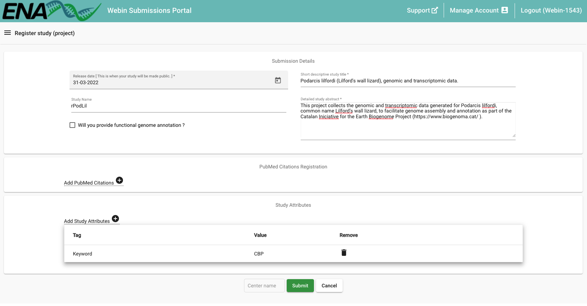
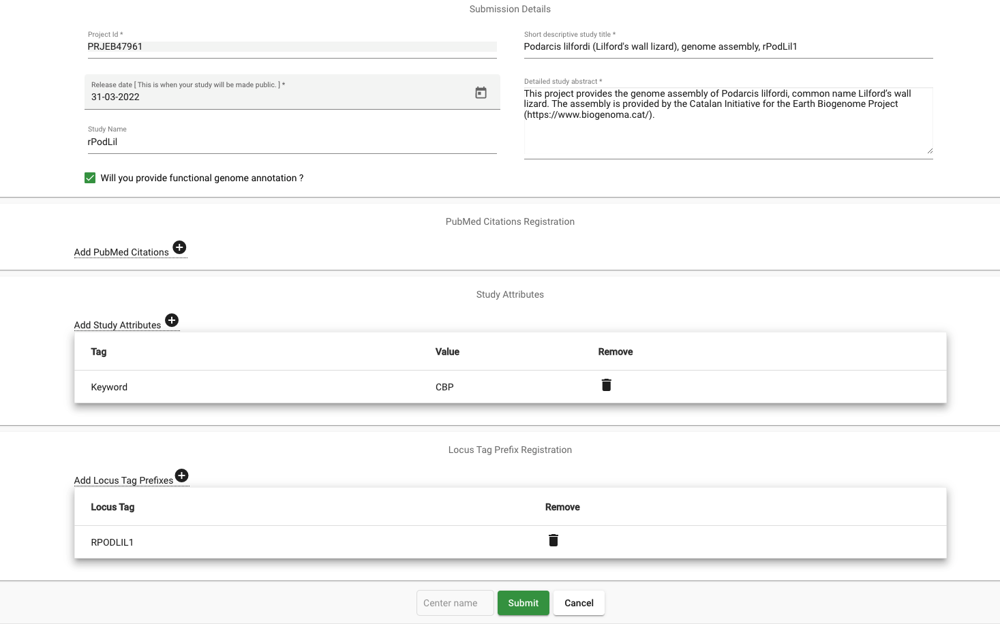
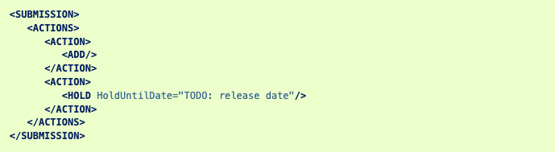
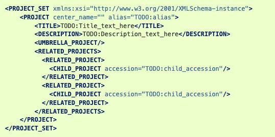
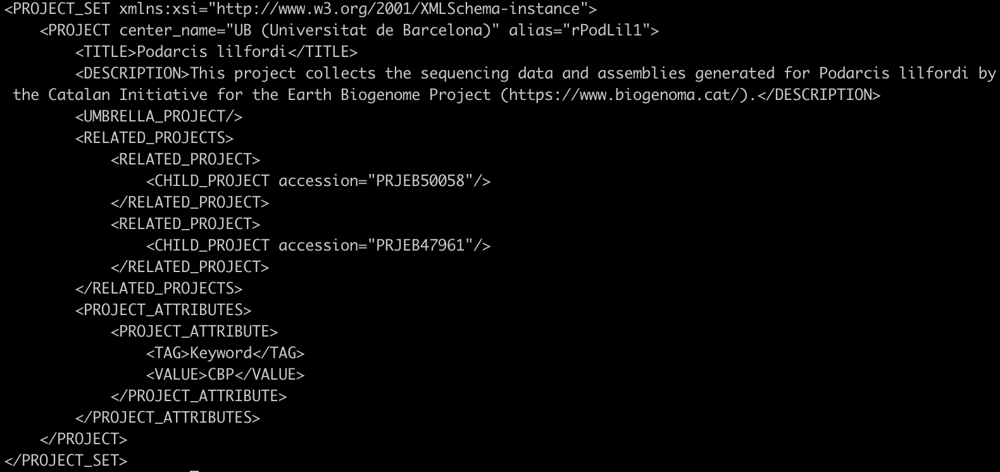

**DATA submission strategy for projects part of the CBP**

Deposition of the sequencing and assembly data is necessary for all
genomes that are part of the CBP. They can both be submitted to the
European Nucleotide Archive (ENA) or to the National Center for
Biotechnology Information (NCBI), but we recommend the ENA. In this
document, we will describe the submission process and the structure that
the projects should have.

---

**Table of Contents**

1. [ TAXID Registration. ](#taxid)
2. [ TOLID Registration. ](#tolid)
3. [ Sample Registration. ](#sample)
4. [ ENA Submission scripts](#submission)
5. [ Project Registration. ](#project)
6. [ Reads Submission. ](#reads)
7. [ Assembly Submission. ](#assembly)
8. [ GoaT Report. ](#goat)
9. [ Data Portal. ](#portal)

---

## Register a new TaxID

if the species does not have a taxonomic identifier, you must follow the instructions in this [link](https://ena-docs.readthedocs.io/en/latest/faq/taxonomy_requests.html) before you can proceed with the next steps

## Registration of a specimen TOLID:

A TOLID ([https://id.tol.sanger.ac.uk/](https://id.tol.sanger.ac.uk/.))
is a unique identifier for an individual of a species sampled for genome
assembly. It is made by a TOLID prefix and a number to indicate the
individual that was sampled. The number is assigned in order of request
and does not represent any ranking. The prefix is made of:

-   a lower-case letter for the high-level taxonomic rank and a
    lower-case letter for the clade. Only one letter is used for
    vertebrates (VGP legacy).

-   one upper, two lower case letters for genus.

-   one upper, three lower case letters for species (one upper, two
    lower case for vertebrates, VGP legacy)

e.g. aRanTem1 for the first sampled individual of Rana temporaria,
xgPerPere3 for the third sampled individual of Peregriana peregra

For naming genome assemblies of samples, we recommend to use the full
ToLID and add .\<version\> Examples:

-   fCotGob3.1 (first assembly version of the 3rd individual of
    Cottoperca gobio)

-   fAstCal1.2 (second assembly version of the first individual of
    Astatotilapia calliptera)

A TOLID for the individual used for genome assembly should be registered
by the sample ambassador in the first place. To read more about TOLIDs
and register yours, go to the following link:
<https://id.tol.sanger.ac.uk/.>

## Register the sample

Generate an ERGA/CBP Manifest via the CBP (link to be updated soon).
Emelio to provide details and instructions on how to do so. I believe we
are using the Tree of Life Checklist (ERC000053) from those listed here:
https://www.ebi.ac.uk/ena/browser/checklists. The portal will generate a
spreadsheet. This should be submit via COPO. We are still negotiating
with Rob Davey how to approve users for the CBP and who will approve the
submissions (currently a small group from ERGA direction is in charge).

## ENA submission scripts

Some scripts to help in data submission have been provided, to use them please read [these instructions](https://github.com/cnag-aat/ERGA-submission/tree/main/get_submission_xmls#readme)

## Create data projects

We will adopt the project structure followed by the DToL. For this
purpose, separate projects for the different types of data should be
registered:

1.  Data project with all the genomic and transcriptomic data produced.

2.  Analysis project with the genome assembly.

3.  Analysis project with the alternate genome assembly (optional).

4.  Species overview umbrella project with the data and analysis
    projects as children.

The projects can be registered either to the ENA or the NCBI, but we
will describe here how to do it in the ENA. The CNAG can broker all CBP
submissions but, if desired, data submission can also be done by the
team responsible for the species. However, command line experience is
recommended, given that some of the steps can only be done
programmatically.

The first step to submit the data is to access the Webin interface with
your ENA/EGA user credentials
(<https://www.ebi.ac.uk/ena/submit/webin/login>). Please, register if
you do not have an account yet.

Once you are logged in into the system you can register the data and
analysis projects by clicking “Register Study (project)” on the
Dashboard. Description on how to fill all the fields for CBP projects is
given below, please, go to
<https://ena-docs.readthedocs.io/en/latest/submit/study.html> for
general details on how to register a project.

The **release date** indicates when the study and all its data will be
made public. When first registering a project, it can be as much as 2
years beyond the present date but you can change it at any time to make
it sooner or later. Once the data becomes public you may not make it
private again.

<u>Data Project registration</u>

-   **Short descriptive study title.** The structure of this should be:
    “***Species name*** (**common name**), genomic and transcriptomic
    data”. For example: “Podarcis lilfordi (Lilford's wall lizard),
    genomic and transcriptomic data”.

-   **Study Name.** TOLID prefix (eg. “rPodLil”).

-   **Detailed study abstract.** “This project collects the genomic and
    transcriptomic data generated for **species**, common name **common
    name**, to facilitate genome assembly and annotation as part of the
    Catalan Initiative for the Earth Biogenome Project
    (<https://www.biogenoma.cat/>).“ For example: “This project collects
    the genomic and transcriptomic data generated for Podarcis lilfordi,
    common name Lilford’s wall lizard, to facilitate genome assembly and
    annotation as part of the Catalan Initiative for the Earth Biogenome
    Project (<https://www.biogenoma.cat/>)”.

-   **Add Study attributes.** Click “+” and add the tag “keyword” and
    the value “CBP”. Then click Add.

Now you can submit the project. A new window will show up with the
assigned project ID, that you can also check in the “Studies Report” tab
of the Dashboard. The project submission page should look like this:

<u>Genome assembly analysis project registration</u>

-   **Short descriptive study title.** The structure of this should be:
    “***Species name*** (**common name**), genome assembly, **TOLID**”.
    For example: “Podarcis lilfordi (Lilford's wall lizard), genome
    assembly, rPodLil1”.

-   **Study Name.** TOLID prefix (eg. “rPodLil”).

-   **Detailed study abstract.** “This project provides the genome
    assembly of **species**, common name **common name**. The assembly
    is provided by the Catalan Initiative for the Earth Biogenome
    Project (<https://www.biogenoma.cat/>).” For example: “This project
    provides the genome assembly of Podarcis lilfordi, common name
    Lilford’s wall lizard. The assembly is provided by the Catalan
    Initiative for the Earth Biogenome Project
    (<https://www.biogenoma.cat/>).”

-   Tick the box on “**will you provide functional genome annotation**”
    if the assembly will be submitted with the annotation.

-   **Add Study attributes.** Click “+” and add the tag “keyword” and
    the value “CBP”. Then click Add.

-   **Add Locus tag prefix (only if it is going to be submitted with the
    annotation).** Click “+” and add the desired locus tag. Then click
    Add. A locus tag prefix can contain only alpha-numeric characters,
    must be at least 3 characters long, upper case, start with a letter,
    and should not contain symbols, such as -\_\*. We recommend using
    the specimen TOLID (eg. RPODLIL1). This prefix will need to be added
    to the ID of each annotated feature.

Now you can submit the project. A new window will show up with the
assigned project ID, that you can also check in the “Studies Report” tab
of the Dashboard.

The project submission page should look like this:

<u>Alternate genome assembly analysis project registration</u>

-   **Short descriptive study title.** The structure of this should be:
    “***Species name*** (**common name**), genome assembly, **TOLID,**
    alternate haplotype”. For example: “Podarcis lilfordi (Lilford's
    wall lizard), genome assembly, rPodLil1, alternate haplotype”.

-   **Study Name.** **TOLID prefix** alternate haplotype (eg.
    “rPodLil”).

-   **Detailed study abstract.** “This project provides the alternate
    haplotype genome assembly of **species**, common name **common
    name**. The assembly is provided by the Catalan Initiative for the
    Earth Biogenome Project (<https://www.biogenoma.cat/>).” For
    example: “This project provides the alternate heplotype genome
    assembly of Podarcis lilfordi, common name Lilford’s wall lizard.
    The assembly is provided by the Catalan Initiative for the Earth
    Biogenome Project (<https://www.biogenoma.cat/>).”

-   Tick the box on “**will you provide functional genome annotation**”
    if the assembly will be annotated.

-   **Add Study attributes.** Click “+” and add the tag “keyword” and
    the value “CBP”. Then click Add.

-   **Add Locus tag prefix.** Click “+” and add the desired locus tag.
    Then click Add. A locus tag prefix can contain only alpha-numeric
    characters, must be at least 3 characters long, upper case, start
    with a letter, and should not contain symbols, such as -\_\*. We
    recommend using the specimen TOLID (eg. RPODLIL1). This prefix will
    need to be added to the ID of each annotated feature.

Now you can submit the project. A new window will show up with the
assigned project ID, that you can also check in the “Studies Report” tab
of the Dashboard.

<u>Species umbrella project registration</u>

To link the independent projects that will contain the data of one
species, we need to register an **umbrella project** that will become a
child of the CBP project and will have as children the data and assembly
projects of that species.

Instructions on how to register umbrella projects can be found at
<https://ena-docs.readthedocs.io/en/latest/faq/umbrella.html>. As stated
there, umbrella studies can only be created and updated from the command
line, by using curl to submit XML files you have created. Following the
ENA documentation, we will show here an example of how the xml files
should look and which is the command to submit them.

First, you need to create a “**submission.xml**” with the following
information:  
  

It is good practice to provide a specific release date for an umbrella
project using the HOLD action in the submission XML. When this date
arrives, the umbrella project will become public automatically. However,
this is optional and if not provided, the release date defaults to two
years after registration.

Each child project is released independently and they each have their
own hold date which is determined on registration, the umbrella project
release does not determine the child project(s) release.

For example, if we want the project to be private until March
31st 2022, our submission.xml file would say:

\<Hold HoldUntilDate= "2022-03-31"/\>

The second xml file we need to create is named **“umbrella.xml”** and it
is where we define all the details of the project.

Edit umbrella.xml to contain the following information:

-   Alias (a unique, informative name for your project). In our case,
    the **TOLID**.

-   Title. For us, the **species name**

-   Description. “This project collects the sequencing data and
    assemblies generated for **species name** by the Catalan Initiative
    for the Earth Biogenome Project (<https://www.biogenoma.cat/>).”

-   Child project accessions

You can add more child projects by inserting more \<RELATED_PROJECT\>
blocks, or you can remove a block from this example if you only wish to
add one project at this time.

If we continue with our Podarcis example, this file would look like:

When you are satisfied with the changes you have made to umbrella.xml
you should run the following command from the directory in which both
XML files are located:

You must edit the command to include your Webin account ID and password.
You will receive a receipt in XML form. You should note the ‘success’
attribute which will be true or false to indicate success or failure of
your submission. If the submission was successful, the receipt will also
contain the accessions of your project. These begin ‘ERP’ and ‘PRJEB’.
The receipt for a failed submission will contain error messages which
will advise you on how to fix your submission.

##  Read submission

After registering the study and samples, you can submit the reads
referring to them. Note that samples and studies will only be associated
after experiments have been submitted. Raw read submissions can be
performed either interactively, programmatically or via webin-cli.
Details on how to carry out read submission in any of these 3 ways can
be found at:
<https://ena-docs.readthedocs.io/en/latest/submit/reads.html>.

All genomic and transcriptomic data, ideally in “fastq.gz” format, used
in the project needs to be submitted under the data project named
“**species name** (**common name**), genomic and transcriptomic data.”

##  Assembly submission

After registering the projects, samples and runs, a genome assembly can
be submitted. This submission will refer to a project (the project for
the assembly that we registered before), a sample, and one or more runs.
The genome assembly can be submitted to the ENA annotated or
unannotated. Detailed instructions on how to perform this step can be
found at:
<https://ena-docs.readthedocs.io/en/latest/submit/assembly.html>. To
simplify the submission process, we have included here some the
recommendations.

Before submitting your assembly, consider the highest level of assembly
which has been obtained. ENA recognizes three assembly levels. An
assembly may contain a mixture of the three sequence types:

-   **Contig:** the highest level of assembly is contigs.

-   **Scaffold:** the highest level of assembly consists of gapped
    contigs (scaffolds).

-   **Chromosome:** the highest level of assembly includes assembled
    chromosomes.

The aim of the CBP is to obtain chromosome level assemblies, but in some
cases this may not be possible. Also note that lower-level assemblies
(eg. contigs or scaffolds) can be updated to chromosome-level after
submission. The term “chromosome” in this context will include both the
nuclear and organellar chromosomes as part of the same submission.

The following instructions show how to submit a genome assembly in
chromosome-level, but with the ENA guide and this example, you should be
able to submit other level assemblies as well.

Before assembly submission some files need to be prepared. First of all,
a **manifest file** that will define the essential metadata shall be
submitted with the following structure:

-   Field name (first column): case insensitive field name

-   Field value (second column): field value

The following metadata fields are supported in the manifest file for
genome context:

-   STUDY: Study accession - mandatory

-   SAMPLE: Sample accession - mandatory

-   ASSEMBLYNAME: Unique assembly name, user-provided - mandatory

-   ASSEMBLY_TYPE: ‘clone or isolate’ - mandatory

-   COVERAGE: The estimated depth of sequencing coverage - mandatory

-   PROGRAM: The assembly program - mandatory

-   PLATFORM: The sequencing platform, or comma-separated list of
    > platforms - mandatory

-   MINGAPLENGTH: Minimum length of consecutive Ns to be considered a
    > gap - optional

-   MOLECULETYPE: ‘genomic DNA’, ‘genomic RNA’ or ‘viral cRNA’
    > - optional

-   DESCRIPTION: Free text description of the genome assembly - optional

-   RUN_REF: Comma separated list of run accession(s) – optional

Various file name fields are supported in the manifest file. Note that
all of these are optional, though of course at least one must be
provided, and some may only be relevant in the presence of other file
types. The available fields are as follows:

-   FASTA: sequences in fasta format

-   FLATFILE: sequences in [EMBL-Bank flat file
    > format](https://ena-docs.readthedocs.io/en/latest/submit/fileprep/flat-file-example.html)

-   AGP: sequences in [AGP
    > format](https://www.ncbi.nlm.nih.gov/assembly/agp/AGP_Specification/)

-   CHROMOSOME_LIST: list of chromosomes

-   UNLOCALISED_LIST: list of unlocalised sequences

In the following page
(<https://ena-docs.readthedocs.io/en/latest/submit/assembly/genome.html>)
you will find instructions on how to prepare each of the files. As a
general idea, keep in mind that you need to provide the assembly either
as a **FASTA** or a **FLATFILE**. In case you do not want to submit the
annotation, you should just give a FASTA file with all the sequences in
your assembly. However, if you want to provide the annotation, an EMBL
file should be produced and submitted with the FLATFILE option. This
embl file needs to follow the ENA format recommendations
(<https://ena-docs.readthedocs.io/en/latest/submit/fileprep/assembly.html#flat-file>).

The <u>CHROMOSOME_LIST</u> file must be provided when the submission
contains assembled chromosomes. The file is a tab separated text file
(USASCII7) up to four columns.

-   **OBJECT_NAME (first column):** The unique sequence name, matching
    with the sequence name in your FASTA file (‘\>’ line) or EMBL flat
    file (‘AC \* ‘ line).

-   **CHROMOSOME_NAME (second column):** The chromosome name. The value
    will appear as the /chromosome, /plasmid or /segment qualifier in
    the EMBL-Bank flat files. There are some restrictions on the values
    that this field should contain, check the ENA link pasted before for
    details. We recommend this to be a **number**, if the chromosome
    number is known. In case the mitochondrial genome is submitted, its
    value can be “**MIT**”.

-   **CHROMOSOME_TYPE (third column):** Allowed values:

    -   chromosome

    -   plasmid

    -   linkage_group

    -   monopartite

    -   segmented

    -   multipartite

-   **CHROMOSOME_LOCATION (optional fourth column):** By default,
    eukaryotic chromosomes will be assumed to reside in the nucleus and
    prokaryotic chromosomes and plasmids in the cytoplasm. Check the
    possible values in the ENA page.

The <u>UNLOCALISED LIST</u> file should be provided when the submission
contains chromosomes with unlocalised sequences. Unlocalised sequences
are contigs or scaffolds that are associated with a specific chromosome
but for which order and orientation is unknown. An example unlocalised
list file:

The unlocalised list file is a tab separated text file (USASCII7)
containing the following columns:

-   **OBJECT_NAME (first column):** the unique sequence name matching a
    FASTA header or flatfile AC \* line

-   **CHROMOSOME_NAME (second column):** the unique chromosome name
    associated with this sequence. This must match with a
    CHROMOSOME_NAME in the chromosome list file.

The <u>AGP</u> file might be used to describe the assembly of scaffolds
from contigs or of chromosomes from scaffolds.

Once all the files needed for assembly submission are ready, they need
to be validated, uploaded and submitted using the [Webin command line
submission
interface](https://ena-docs.readthedocs.io/en/latest/submit/general-guide/webin-cli.html) (Webin-CLI).
Please refer to the [Webin command line submission
interface](https://ena-docs.readthedocs.io/en/latest/submit/general-guide/webin-cli.html) documentation
for full information about the submission process.

##  GoaT Report

[GoaT](https://goat.genomehubs.org/) is the official sequencing status tracker of the Earth Biogenome Project.
From the CBP we generate a [report](https://docs.google.com/document/d/1v07sLdzDiWF5Pge4hYUd67wQ-dXTWK7EMRTp0i0vlD8/edit#heading=h.r98o47b47e3u) that updates GoaT, thus the EBP, with our sequencing progresses.
The report is generated from the [portal](https://dades.biogenoma.cat/status) and <a href="mailto:emilio.righi@crg.eu">Emilio Righi</a> is in charge of it.

**It is very important to send an email to him to update the sequencing status of the species when:**

- the sequencing data of the species are not yet submitted to INSDC or are submitted but with an embargo (they are not public yet)
- a paper related to the sequenced species is published
- the sequencing status of the species is updated, for instance the DNA has been sequenced etc.

The portal will retrieve all the data published to INSDC under the CBP umbrella, this means that it is not necessary to update Emilio if the data are already public, the process is automatized!

For more info about the sequencing status take a look at this [document](https://docs.google.com/document/d/1v07sLdzDiWF5Pge4hYUd67wQ-dXTWK7EMRTp0i0vlD8/edit#heading=h.r98o47b47e3u)

##  Data Portal

The [data portal](https://dades.biogenoma.cat/) collates the INSDC metadata with other metadata defined within the CBP, such as photos, vernacular names, custom metadata, publications and genome annotations.

- If you have any image of the collected species that you want to put in the data portal. First publish this image into Zenodo, Wikimedia or any other public images database, then provide the link to <a href="mailto:emilio.righi@crg.eu">Emilio Righi</a>
- Any other relevant information of the collected species can also be provided, catalan name, etc (Note that this are the species metadata and not the sample metadata)
- The portal has also a genome browser where the genome annotation of the sequences species can be visualized, but it is first necessary to publish the genome assembly, chromosome level, to INSDC. If this is your case you can provide <a href="mailto:emilio.righi@crg.eu">Emilio Righi</a> with genome annotation files in the following formats: the gzipped gff (gff.gz) and the tabindexed gzipped gff (gff.gz.tbi)

